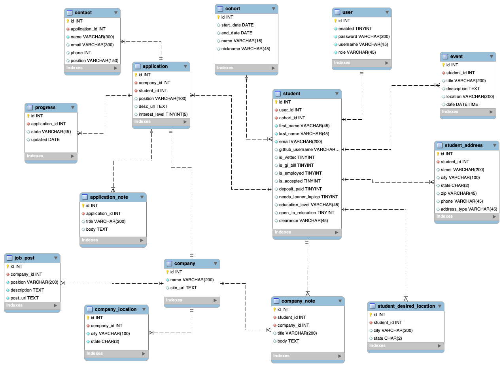
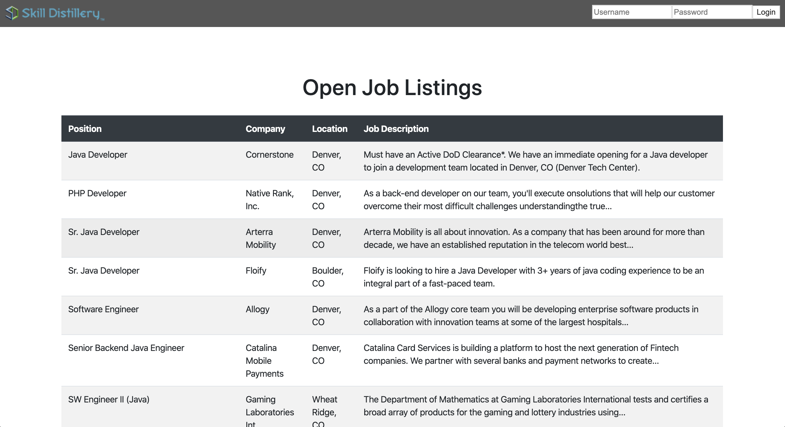
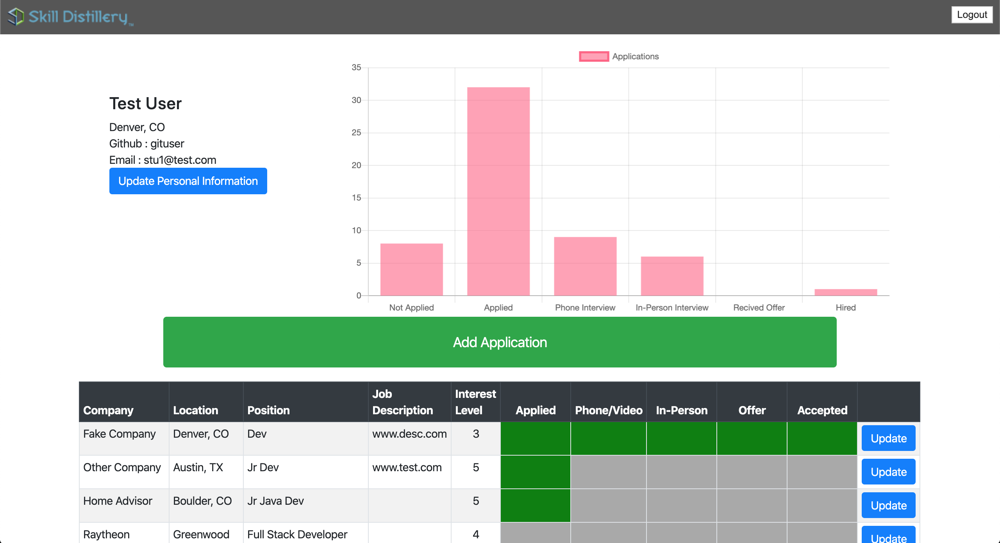
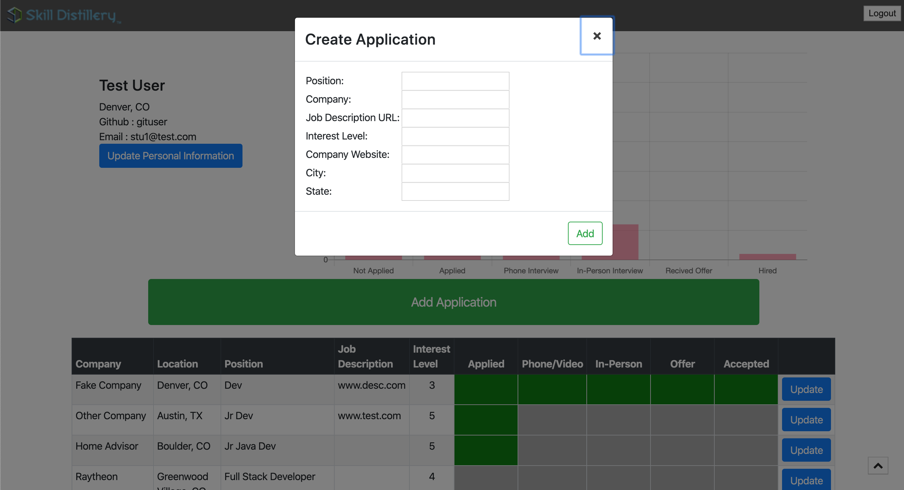
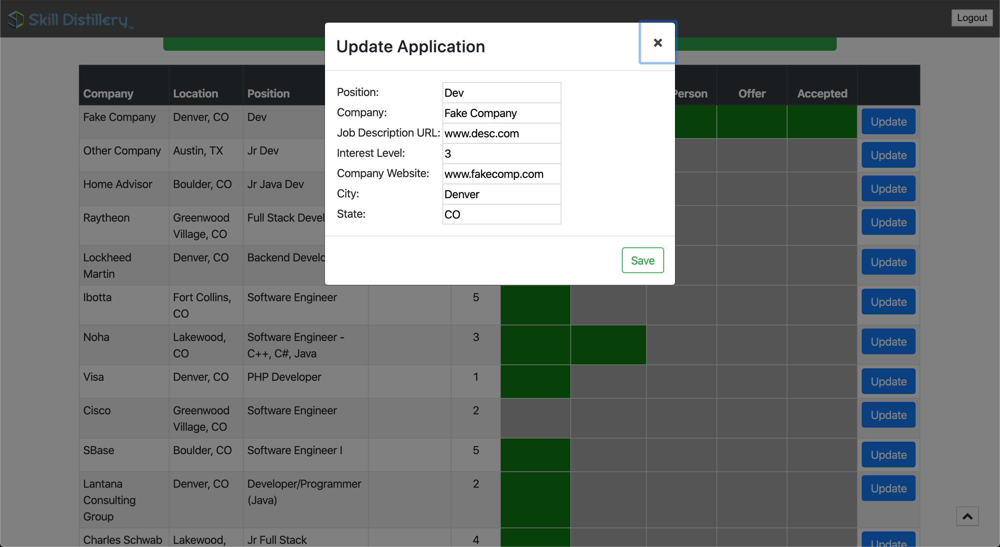
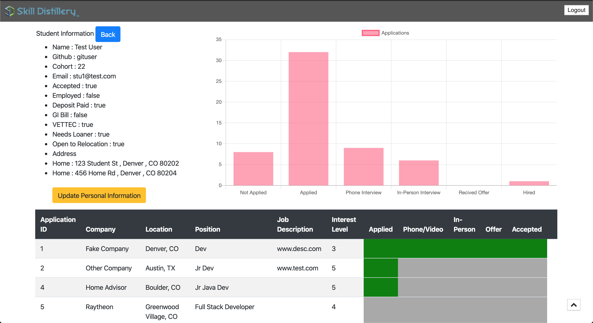

# Job Tracker
Final Team Project for Skill Distillery's 16 Week Full-Stack Bootcamp
* Branden Bent - Developer, Scrum Master
* Mark Agbayani - Developer
* Daniel Bautista - Developer, Database Administrator
* Casey Asher - Developer
* Connor Campora - Developer, Repository Owner

Nearing the completion of this course, we were introduced to a Google Docs spreadsheet that we were told would help us organize our job hunting process and let Skill Distillery's administration see where individual students are struggling within the hunt and when they were hired. Each student received a link to their own spreadsheet and we saw that there was an opportunity to simplify the student tracking process for the administration and to increase student engagement within that tracking process. Students Daniel Bautista and Mark Agbayani pitched the project and received approval.

This program is the result of a 9 day sprint. We used Angular for our front-end and the Spring framework for our back-end.

We took advantage of Angular's modular nature to split our program into many components and nested those components within each other. From the top level, our program is broken into header, admin, and student components. Upon login, the user's role is stored in browser's local storage and the appropriate component (admin or student) is displayed.

Admin has CRUD capabilities for students, other admins, cohorts and students within those cohorts. Upon selecting a student from a cohort, the admin will be able to see the student's applications, where they are in the process, and a chart displaying how many applications are at each stage of the job hunting process.

From the student component, a student is able to edit their personal information, view a summary of their application statuses, and perform CRUD on their applications. In addition to the jobs a student has input, there is also a component that displays a feed of the top ~20 developer jobs in the Denver area from Indeed. That component makes a request to Indeed and reads the job postings from the HTML using a regex and then displays those postings on our homepage and within the student view.

## Screenshots

Database Schema

Homepage

Student View on Login

Add a job application

Update a job application

Cohort View

Viewing a student in a Cohort

## Technologies Used

* Spring Toolsuite
* SpringBoot
* Angular
* Visual Studio Code
* Atom
* MySQL, MySQL Workbench
* Git, GitHub
* MAMP, POSTMAN
* Java, Javascript, Typescript, HTML, CSS
